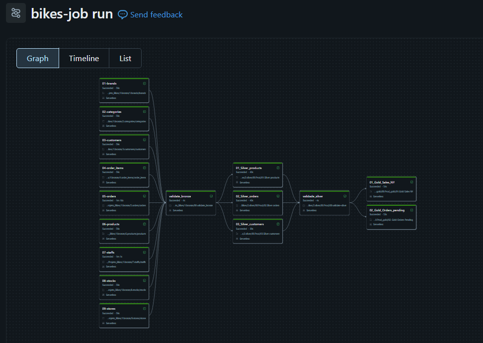

# 🚲 Bikestore Lakehouse Pipeline

Pipeline de dados end-to-end utilizando arquitetura **Medallion (Bronze → Silver → Gold)** no **Databricks**, com armazenamento em **Azure Data Lake Storage Gen2 (ADLS)** e governança via **Unity Catalog**.

O projeto simula um cenário real de engenharia de dados para uma loja de bicicletas (Bikestore), processando dados de vendas, produtos, clientes, pedidos e estoque.

---

## 🏗️ Arquitetura

O pipeline segue o padrão de arquitetura em camadas (Medallion Architecture):

**Bronze** (dados brutos) → **Silver** (dados tratados) → **Gold** (dados agregados)

### 🥉 Camada Bronze
- Ingestão de dados brutos em formato **Delta Lake**
- Criação de tabelas temporárias (temp views) para cada entidade: `brands`, `categories`, `customers`, `order_items`, `orders`, `products`, `staffs`, `stocks`, `stores`
- Sem transformação de dados — fidelidade total à fonte original

### 🥈 Camada Silver
- Limpeza e padronização dos dados (remoção de nulos, tratamento de tipos)
- Joins entre entidades relacionadas (ex: produtos + categorias + marcas + estoque)
- Cálculos financeiros com precisão decimal exata (`DECIMAL(10,2)`), evitando erros de arredondamento em ponto flutuante
- Persistência como tabelas Delta físicas, registradas no Unity Catalog

### 🥇 Camada Gold
- Agregações orientadas a negócio, prontas para consumo analítico
- Exemplos: total de vendas por estado/data, pedidos pendentes por cliente
- Tabelas otimizadas para consulta direta via SQL ou dashboards

---

## ⚙️ Orquestração (Jobs & Workflows)

O pipeline é orquestrado via **Databricks Jobs**, com dependências explícitas entre tasks (`depends on`), garantindo que cada camada só seja processada após a validação da camada anterior:

### 🥉 Camada Bronze
- Ingestão de dados brutos em formato **Delta Lake**
- Criação de tabelas temporárias (temp views) para cada entidade: `brands`, `categories`, `customers`, `order_items`, `orders`, `products`, `staffs`, `stocks`, `stores`
- Sem transformação de dados — fidelidade total à fonte original

### 🥈 Camada Silver
- Limpeza e padronização dos dados (remoção de nulos, tratamento de tipos)
- Joins entre entidades relacionadas (ex: produtos + categorias + marcas + estoque)
- Cálculos financeiros com precisão decimal exata (`DECIMAL(10,2)`), evitando erros de arredondamento em ponto flutuante
- Persistência como tabelas Delta físicas, registradas no Unity Catalog

### 🥇 Camada Gold
- Agregações orientadas a negócio, prontas para consumo analítico
- Exemplos: total de vendas por estado/data, pedidos pendentes por cliente
- Tabelas otimizadas para consulta direta via SQL ou dashboards

---

## ⚙️ Orquestração (Jobs & Workflows)

O pipeline é orquestrado via **Databricks Jobs**, com dependências explícitas entre tasks (`depends on`), garantindo que cada camada só seja processada após a validação da camada anterior:

[Bronze Tables] --> [validate_bronze] --> [Silver Tables] --> [validate_silver] --> [Gold Tables]

- Execução **Serverless**
- Validações intermediárias (`validate_bronze`, `validate_silver`) garantem qualidade antes de avançar de camada
- Job monitorável via interface de **Runs**, com histórico de execução, duração e status por task

---

## 🛠️ Tecnologias utilizadas

| Categoria | Tecnologia |
|---|---|
| Processamento | Apache Spark (PySpark, Spark SQL) |
| Plataforma | Databricks (Serverless Compute) |
| Armazenamento | Azure Data Lake Storage Gen2 (ADLS) |
| Formato de dados | Delta Lake |
| Governança | Unity Catalog |
| Orquestração | Databricks Jobs & Workflows |
| Linguagens | Python, SQL |

---

## 📁 Estrutura do projeto

- `Projeto_Bikes/`
  - `1.bronze/`
  - `2.silver/`
  - `3.gold/`
- `docs/`
- `README.md`

---

## 📊 Principais desafios técnicos resolvidos

- **Consistência de arredondamento financeiro**: cálculos de desconto e valor líquido implementados com fórmulas independentes e `CAST ... AS DECIMAL`, evitando divergências de centavos entre colunas relacionadas
- **Padronização de paths**: alinhamento de nomenclatura (singular/plural) entre as pastas físicas no ADLS e as tabelas registradas no Unity Catalog
- **Autenticação segura com Azure**: configuração de acesso ao ADLS Gen2 via Storage Account Key / Service Principal

---

## 🚀 Como executar

1. Configure as credenciais de acesso à sua Storage Account no Databricks (`spark.conf.set`)
2. Ajuste as variáveis de path (`bronze_path`, `silver_path`, `gold_path`) para o seu ambiente
3. Execute os notebooks na ordem: Bronze → Silver → Gold
4. (Opcional) Configure um Databricks Job para orquestração automática

---

## 📊 Resultados

Os dados finais da camada Gold estão disponíveis em [`data/gold/`](data/gold/), incluindo:

- [`gold_sales_ny.csv`](data/gold/gold_sales_ny.csv) — total de vendas agregado por data de envio, filtrado para o estado de NY
- [`gold_orders_pending.csv`](data/gold/gold_orders_pending.csv) — pedidos pendentes por cliente

Esses arquivos representam o resultado final do pipeline, prontos para consumo em ferramentas de BI ou análise exploratória.

---

## 👤 Autor

**Darles Leivas**  
Projeto desenvolvido como parte de estudos em Engenharia de Dados com Databricks, Spark e Azure.
